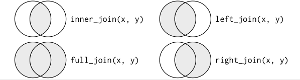

## Importaciones

Importamos las bibiliotecas necesarias para desarollar el codigo y garantizar su funcionamiento.

```{r}
library(dplyr) #verbos que resuelven desafios de manipulacion de datos mas comunes (filter, mutate, select...)
library(magrittr)
library(tidyverse)
library(pdftools)
#library(stringr) viene incluido en tidyverse (permite trabajo facil con cadenas)
library(lubridate) #para fechas y horas
```

## Objetivos

A desarrollar

## Ruta

Determinamos la ruta donde se encuentra nuestro docucmento. Al tener el documento dentro del proyecto creado, no hace falta poner la ruta completa, sino que con poner solo el nombre del documento con el que estamos trabajando es suficiente. 

```{r}
txt <- pdf_text("Sample_3_v88.pdf")
txt
str(txt)
```

```{r}
#Separamos las distintas hojas que puede llegar a tener el documento, en este caso 3.
cat(txt[1])
cat(txt[2])
cat(txt[3])
```

## Tratamiento texto

```{r}
#Separamos el texto por cadenas de caracteres.
raw_text <- pdftools::pdf_text("C://Users/luciv/OneDrive/Documentos/R/Sample_3_v88.pdf") %>%   
  str_split("\n") %>%   
  #unlist nos permite extraer vectores para que queden bien separados
  unlist()
raw_text
```

```{r}
#Elegimos las filas que nos interesan
#Numero chip (carpeta)
chip <- raw_text[1] #inventado
chip
#Numero paciente (carpeta)
paciente <- raw_text[2] #inventado
paciente
#Fecha informe
fecha <- unlist(str_split(raw_text[7], "\\s{2,}"))[3]
fecha
#NHC
NHC <- unlist(str_split(raw_text[7], "\\s{2,}"))[1]
NHC
#Numero biopsia
Nbiopsia <- unlist(str_split(raw_text[7], "\\s{2,}"))[2]
Nbiopsia
#Biopsia solida
biopsia <- raw_text[3] #inventado
biopsia
#Texto diagnostico
Texto <- raw_text[9]
Texto
#Mutaciones
raw_text[145]
raw_text[149]
raw_text[150]
#Podemos obtener las mutaciones por filas o crear una variable llamada mutacione que almacene las mutaciones
mutaciones <- raw_text[c(145, 149, 150)]
mutaciones
mutacion <- unlist(str_split(raw_text[34], "\\s{2,}"))[1]
mutacion
#Frecuencia alelica %
raw_text[24]
frecuencia <- unlist(str_split(raw_text[34], "\\s{2,}"))[5]
frecuencia
#Numero mutacion
nm <- unlist(str_split(raw_text[34], "\\s{2,}"))[3] #inventado
nm
#Tipo mutacion especifica (Extra)
espe <- unlist(str_split(raw_text[34], "\\s{2,}"))[2] 
espe
#Farmaco aprobado
farmaco <-raw_text[14] #inventado
farmaco
# Ensayo cl?nico
ensayo <- raw_text[c(99:115)]
ensayo
#Benigno - maligno (extra)
bm <- unlist(str_split(raw_text[34], "\\s{2,}"))[9]
bm
#Numero diagnostico
Ndiagnostico <- raw_text[34]
Ndiagnostico
```

## Cambio formato character a fecha
Nos interesa qu el formato fecha este almacenado como un date y no como character, por ello usamos la funcion dmy para que nos devuelva la fecha como formato dia-mes-año. 
Sin embargo, en este caso no es posible porque mi ordenador esta configurado para estar año-mes-dia. Al no cambiar esa configuracion, no es posible que esta funcion funcione correctamente. 
```{r}
prueba_fecha <- unlist(str_split(raw_text[7], "\\s{2,}"))[3]
prueba_fecha
y<- dmy(prueba_fecha)
#Al reves porque mi ordenador esta configurado para poner primero añno y no dia
y
str(y)

```

## Quitamos espacios en blanco
```{r}
table_start <- stringr::str_which(raw_text, "Datos paciente: ")
table_end <- stringr::str_which(raw_text, "ERBB2, PDGFRA, PPARG")

table_trimmed <- raw_text[table_start:table_end] %>% 
  str_trim()
table_trimmed
```


```{r}
#Como vemos que los espacios en blanco tambien se almacenan, los quitamos
squished_table <- str_replace_all(table_trimmed, "\\s{2,}", "|") %>% 
  str_remove_all(",")
squished_table
#No elimina los espacios que hay entre una fila y otra, sino que elimina los espacios dentro de una misma fila 
#ELIMINA EL ESPACIO ENTRE COLUMNAS EN UNA FILA
#Cambia los espacios de m?s de dos espacios (  ) por |

#Cambio los : por | dentro de la misma fila.

squised_table2 <- str_replace_all(squished_table, ": ", "|")%>% 
  str_remove_all(",")
squised_table2
```

## Dataframes
Se puede usar tanto data.frame() como read.table(). 
Con data.frame() cogemos los vectores que hemos separado antes como argumentos y los combina. 
La función read.table() lee un archivo de texto como argumento y lo pasa a dataframe.Crea un archivo con los datos a incluir en el dataframe y al leerlo con read.table() lo convertimos en dataframe. 
Usamos el primer método porque anteriormente ya habíamos separado las partes de interés del PDF para crear los dataframes. 

```{r}
tabla1pacientes <- tibble(
  `Número chip` = chip,
  `Número paciente` = paciente,
  `NHC` = NHC,
  `Número biopsia` = Nbiopsia,
  `Fecha informe` = y
)
tabla1pacientes
typeof(tabla1pacientes)
is(tabla1pacientes) #Devuelve distintos tipos de variables dentro del tibble

```

```{r}
tabla2Biopsia <- tibble(
  `Biopsia sólida` = biopsia,
  `Número biopsia` = Nbiopsia,
  `Diagnóstico` = Texto,
  `Mutaciones detectadas` = mutacion
)
tabla2Biopsia

```

```{r}
tabla3Mutaciones <- tibble(
  `Mutaciones detectadas` = mutacion,
  `Tipo mutación específica` = espe,
  `Porcentaje frecuencia alélica` = frecuencia,
  `Benigna/patogénica` = bm,
  `Ensayos clínicos` = ensayo,
  `Fármaco aprobado` = farmaco
)
tabla3Mutaciones
```

```{r}
tabla4SubtipoMutacion <- tibble(
  `Mutaciones detectadas` = mutacion,
  `Tipo mutación específica` = espe, 
  `Número mutación` = nm
)
tabla4SubtipoMutacion
```

```{r}
tabla5Diagnostico <- tibble(
  `Diagnóstico` = Texto,
  `Número diagnóstico` = Ndiagnostico
)
tabla5Diagnostico
```

```{r}
#Esta tabla contiene la relacion entre todas las mutaciones junto con el numero de mutacion que le corresponde. 
#Es una numeracion unica del Hospital Universitario de Burgos, de forma que usar este codigo en otro hospital, no funcionaria correctamente. 
#A cada numero de mutación le han asignado un numero siguiendo el orden del alfabeto (a la primera mutación que apareceria en el alfabeto le corresponde el numero uno, a la siguiente el dos y asi sucesivamente...)
nombres = "a, b, c, d, e, f, g, h"
tabla6EspecificacionMutaciones <- tibble(
  `Nombre mutaciones` = nombres,
  `Número mutacion` = nm
)
tabla6EspecificacionMutaciones
```

```{r}
datacompleto <- rbind(tabla1pacientes, tabla2Biopsia, tabla3Mutaciones, tabla4SubtipoMutacion)
#No podemos usar rbind para unir los dataframes porque no coinciden el número de columnas en cada uno de ellos. 
```
## Inner join ANTIGUO
No está mal, pero hay código más nuevo con el que se puede hacer los distintos join que usando merge. Usando el libro r4ds puedo ver los distintos tipos y elegir el que mejor me va a venir a mi. 
```{r}
c1 <- merge(x = tabla1pacientes, y = tabla2Biopsia)
c1
```

```{r}
c2 <- merge(x = c1, y = tabla5Diagnostico)
c2
```
```{r}
c3 <- merge(x = c2, y = tabla3Mutaciones)
c3
```

```{r}
c4 <- merge(x = c3, y = tabla4SubtipoMutacion)
c4
```
```{r}
c5 <- merge(x = c4, y = tabla6EspecificacionMutaciones)
c5
```
## Inner join NUEVO
Es el tipo de unión más simple. Se crea un nuevo dataframe que contiene como nexo de unión aquellas columnas que coinciden. Se usa by para decir a dplyr cual es la variable clave (KEY).

Nos coloca la columna en común entre los valores de las dos tablas. 
Uso by = join_by para determinar.

Devuelve una tabla con las columnas que hay en común en ambos dataframes. ¿?¿?¿?¿?
```{r}
c1 <- tabla1pacientes %>%
  inner_join(tabla2Biopsia, by = join_by(
  `Número biopsia`))
c1
```
```{r}
c2 <- c1 %>% 
  inner_join(tabla5Diagnostico, by = join_by(`Diagnóstico`))
c2
```
```{r}
c3 <- c2 %>% 
  inner_join(tabla3Mutaciones, by = join_by(`Mutaciones detectadas`))
c3
```

```{r}
c4 <- c3 %>% 
  inner_join(tabla4SubtipoMutacion, by = join_by(`Tipo mutación específica`))
c4
```

```{r}
c5 <- c4 %>% 
  inner_join(tabla6EspecificacionMutaciones, by = join_by(`Número mutacion`))
c5
```


## Outer join NUEVO
### Left join
Teniendo dos dataframes. De uno almacena toda la información, pero del otro solo almacena aquellas columnas que coinciden con el primero.
No me interesa orque yo lo que quiero es obtener la información de ambas tablas. 
### Right join
Partiendo de dos dataframes, almacena la información completa del segundo, mientras que del primero solo almacena las columnas que coinciden con el segundo. 
No me interesa porque yo quiero as columnas de ambas tablas. 
### Full join
Almacena todas las columnas de los dos, tanto aquellas que son comunes en ambos como los que no lo son. Se usa NULL como valor por defecto en algunos de los casos. 
```{r}
t1 <- tabla1pacientes %>%
  full_join(tabla2Biopsia, by = join_by(`Número biopsia`))
t1
```
```{r}
t2 <- t1 %>%
  full_join(tabla5Diagnostico, by = join_by(`Diagnóstico`))
t2
```

```{r}
t3 <- t2 %>% 
  full_join(tabla3Mutaciones, by = join_by(`Mutaciones detectadas`))
t3
```

```{r}
t4 <- t3 %>% 
  full_join(tabla4SubtipoMutacion, by = join_by(`Tipo mutación específica`))
t4
```
```{r}
t5 <- t4 %>% 
  full_join(tabla6EspecificacionMutaciones, by = join_by(`Número mutacion`))
t5
```


## Diagrama de Venn
```{r}
 
```

```{r}
#EJEMPLOS DE INTERNET QUE SUPUESTAMENTE FUNCIONAN
#{width='100px'}
#
```

```{r}
#
```

```{r, out.width="50%", include=TRUE, fig.align="center", fig.cap=c("Joins."), echo=FALSE}

```


## For en R
Para hacer un for en R hay que tener en cuenta:
1. Espacio de salida. Antes de crear el bucle for, hay que asegurarse de que hay suficiente espacio para la salida. Para ello se usa la función vector(), al cual se le dan el tipo de vector y la longitud. 
2. Secuencia. Determina la repetición. En cada ejecución se asignará i a un valor diferente. 
(Uso seq_along para generar secuencias regulares)
3. Cuerpo. Código que realiza el trabajo. Cada vez se ejecuta con un i diferente. 
```{r}
output <- vector("list", ncol(tabla1pacientes))
for (i in tabla1pacientes){
  output[i] <- append(tabla1pacientes[[i]])
}
#output
```

```{r}

}
```


Para importar el csv hay varias maneras, la mejor de ellas es la que usa \_ (?por qu??)

```{r}
write.csv()
write_csv() #mejor
```

This is an [R Markdown](http://rmarkdown.rstudio.com) Notebook. When you execute code within the notebook, the results appear beneath the code.

Try executing this chunk by clicking the *Run* button within the chunk or by placing your cursor inside it and pressing *Ctrl+Shift+Enter*.

```{r}
plot(cars)
```

Add a new chunk by clicking the *Insert Chunk* button on the toolbar or by pressing *Ctrl+Alt+I*.

When you save the notebook, an HTML file containing the code and output will be saved alongside it (click the *Preview* button or press *Ctrl+Shift+K* to preview the HTML file).

The preview shows you a rendered HTML copy of the contents of the editor. Consequently, unlike *Knit*, *Preview* does not run any R code chunks. Instead, the output of the chunk when it was last run in the editor is displayed.
